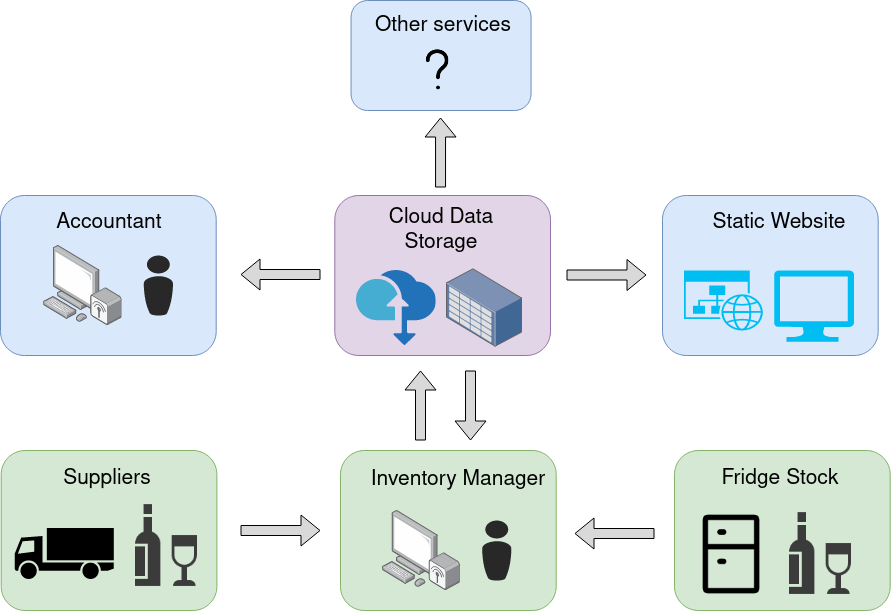

## Friday Hygge

This organization contains the source code used in running the Friday Hygge.

Supplies and inventory entries are managed by the _inventory manager_. It updated the cloud data storage from which all the services extract the data. The proposed services are: a static website acting as an online catalogue of drinks, and an __accountant_ that creates summary reports from the data in the cloud.

* The Static website is accessible in: https://github.com/FridayHygge/fridayhygge.github.io
* The accounting software is accessible at: 🏗️
* The inventory manager GUI is accessible at: 🏗️

